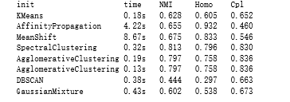
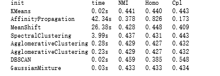

# 聚类算法的应用及比较
## 聚类算法
### Kmeans算法
### AffinityPropagation相似传播算法
### MeanShift算法
### SpectralClustering算法
### Ward hierarchical clustering算法
### AgglomerativeClustering算法
### DBSCAN算法
### Gaussian Mixtures 算法
## 手写字数据集上的各算法的比较
### 实验运行结果

### 可视化
对数据中的每张图片，进行PCA进行降维                  

## 文本数据集上的个算法的比较
### 运行结果
对于数据汇总中的每个文本，用svd进行降维

### 可视化

