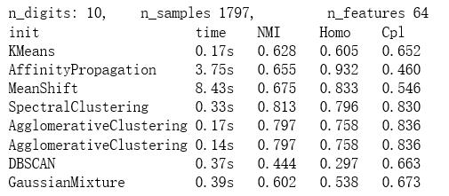
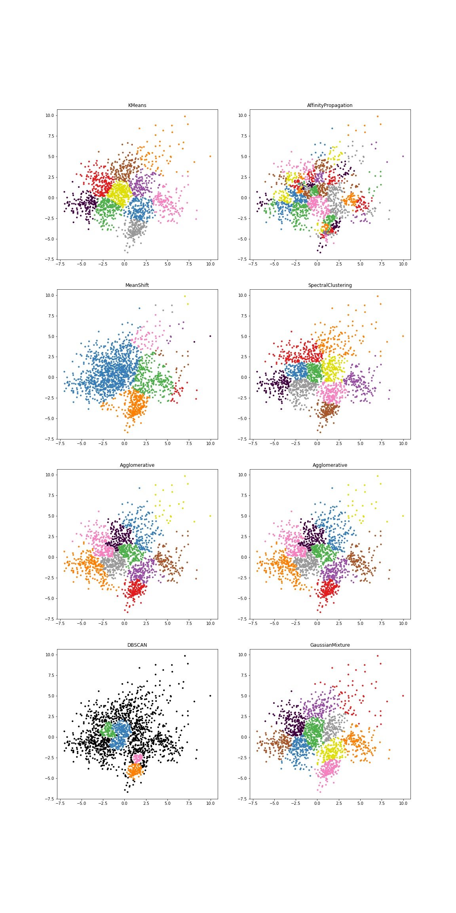

# 聚类算法的应用及比较
## 数据集
本次实验采用了两个数据集，分别是digit手写字数据集和document文本数据集，这两个数据集都集成在了SkLearn中
### digit数据集
* 调用方法
  > `sklearn.datasets.load_digits()`
* 数据示例
  > 
### document数据集
* 调用方法
  >`sklearn.datasets.fetch_20newsgroups()`
* 数据示例
  > 
## 手写字数据集上的各算法的比较
### 实验运行结果

### 可视化
对数据中的每张图片，进行PCA进行降维                   

## 文本数据集上的个算法的比较
由于该数据集有20类样本，如果考虑20类样本的话，数据过多，聚类的时间会较慢，而且也不便于可视化，所以此次选取了数据集中的4类样本来进行聚类
### 运行结果

### 可视化
对于数据汇总中的每个文本，用svd进行降维 

## 聚类算法
### Kmeans算法
### AffinityPropagation相似传播算法
### MeanShift算法
### SpectralClustering算法
### Ward hierarchical clustering算法
### AgglomerativeClustering算法
### DBSCAN算法
### Gaussian Mixtures 算法
