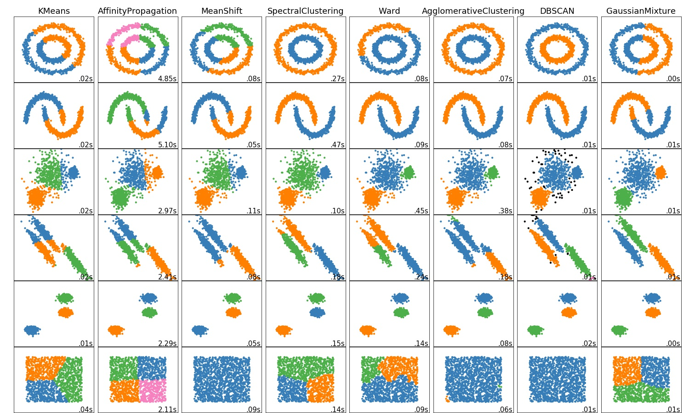

# 聚类算法的应用及比较
## 数据集
&ensp;&ensp;&ensp;&ensp;本次实验采用了两个数据集，分别是digit手写字数据集和document文本数据集，这两个数据集都集成在了SkLearn中
### digit数据集
* 调用方法
  > `sklearn.datasets.load_digits()`
* 数据示例
  > 
### document数据集
* 调用方法
  >`sklearn.datasets.fetch_20newsgroups()`
* 数据示例
  > 
## 手写字数据集上的各算法的比较
### 运行结果

### 可视化
&ensp;&ensp;&ensp;&ensp;&ensp;对数据中的每张图片，进行PCA进行降维                

## 文本数据集上的个算法的比较
&ensp;&ensp;&ensp;&ensp;由于该数据集有20类样本，如果考虑20类样本的话，数据过多，聚类的时间会较慢，而且也不便于可视化，所以此次选取了数据集中的4类样本来进行聚类
### 运行结果

### 可视化
&ensp;&ensp;&ensp;&ensp;对于数据汇总中的每个文本，用svd进行降维

## 各类聚类算法比较
### Kmeans算法
*    &ensp;&ensp;&ensp;&ensp;KMeans算法又名k均值算法。其算法的思想大致为：先从样本中选取k个样本作为簇中心，并计算所有样本与当前“簇中心”的距离，对于每一个样本，将其划分到与其距离最近的“簇中心”所在的簇中，对于新的簇计算各个簇的的新的“簇中心”。
*    &ensp;&ensp;&ensp;&ensp;根据上述描述，我们可以概括KMeans算法的三个要点 
    1. 簇个数k的选择 
    2. 各个样本到“簇中心”的距离 
    3. 根据新划分的簇，更新“簇中心”
### AffinityPropagation相似传播算法
*    &ensp;&ensp;&ensp;&ensp;AP聚类算法是基于数据点间的"信息传递"的一种聚类算法。与k-均值算法或k中心点算法不同，AP算法不需要在运行算法之前确定聚类的个数。AP算法寻找的"examplars"即聚类中心点是数据集合中实际存在的点，作为每类的代表。
*    &ensp;&ensp;&ensp;&ensp;从实验中我们可以看出，AP聚类算法生成的类的个数往往并不是实际类别的个数
### MeanShift算法
*    &ensp;&ensp;&ensp;&ensp;meanshift算法其实通过名字就可以看到该算法的核心，mean（均值），shift（偏移），简单的说，也就是有一个点a,它的周围有很多个点{b计算点a动到{b}中每个点所需要的偏移量之和，求平均，就得到平均偏移量，（该偏移量的方向是周围点分布密集的方向）该偏移量是包含大小和方向的。然后点a就往平均偏移量方向移动，再以此为新的起点不断迭代直到满足一定条件结束。
*    &ensp;&ensp;&ensp;&ensp;MeanShift模型在训练时bandwidth的选择是很重要的，他影响着最后聚类的结果，具体体现为最终形成类别的多少
### SpectralClustering算法
*    
### Ward hierarchical clustering算法
*    &ensp;&ensp;&ensp;&ensp;层次聚类算法主要思想：初始时将每个数据点视为一个类别，选取两个距离最近的类将其合并，这样不断的迭代最终达到想要的类别数停止
*    &ensp;&ensp;&ensp;&ensp;算法最主要的就是要选择簇间距离的更新，常用的簇间距离的更新规则如下： 
      &ensp;&ensp;&ensp;&ensp;&ensp;1.最小距离，单链接Single Linkage  
        &ensp;&ensp;&ensp;&ensp;&ensp;&ensp;&ensp;两个簇的最近样本决定。  
      &ensp;&ensp;&ensp;&ensp;&ensp;2.最大距离，全链接Complete Linkage  
        &ensp;&ensp;&ensp;&ensp;&ensp;&ensp;&ensp;两个簇的最远样本决定。  
      &ensp;&ensp;&ensp;&ensp;&ensp;3.平均距离，均链接Average Linkage 
        &ensp;&ensp;&ensp;&ensp;&ensp;&ensp;&ensp;两个簇所有样本共同决定。 
### AgglomerativeClustering算法
### DBSCAN算法
*    &ensp;&ensp;&ensp;&ensp;DBSCAN是基于密度空间的聚类算法，与KMeans算法不同，它不需要确定聚类的数量，而是基于数据推测聚类的数目，它能够针对任意形状产生聚类。
*    &ensp;&ensp;&ensp;&ensp;在运行DBSCAN算法时，关键是epsilon和MinPoint的选择，在进行实验时要根据数据的特点进行选择
### Gaussian Mixtures 算法
*    &ensp;&ensp;&ensp;&ensp;事实上，Gaussian Mixtures Model (GMM) 和 k-means 很像，不过 GMM 是学习出一些概率密度函数来（所以 GMM 除了用在 clustering 上之外，还经常被用于 density estimation ），简单地说，k-means 的结果是每个数据点被 assign 到其中某一个 cluster 了，而 GMM 则给出这些数据点被 assign 到每个 cluster 的概率，又称作 soft assignment 。
### 结果比较图
*    &ensp;&ensp;&ensp;&ensp;为了形象的展示每个聚类算法的不同，我们展示了在不同生成数据集上的效果

### 总结
*    &ensp;&ensp;&ensp;&ensp;不同的聚类算法有各自的特点。在聚类算法中有基于距离的算法，也有基于密度的算法，还有基于概率分布的算法，不同的算法在处理不同的问题上有着自己的特点，对于digit数据集来说，我们可以发现KMeans，层次聚类还有Agglomerative聚类算法的效果比较好。而对于document数据集来说，KMeans算法和Gaussian Mixtures算法比较好。

## 代码
[digits数据集聚类代码](homework_1_digit.ipynb "digits数据集") 
[document数据集聚类算法](homework_1_document.ipynb "document数据集") 
[各类算法的比较](plot_cluster_comparison.ipynb "各类算法的在不同数据集上的比较")  
